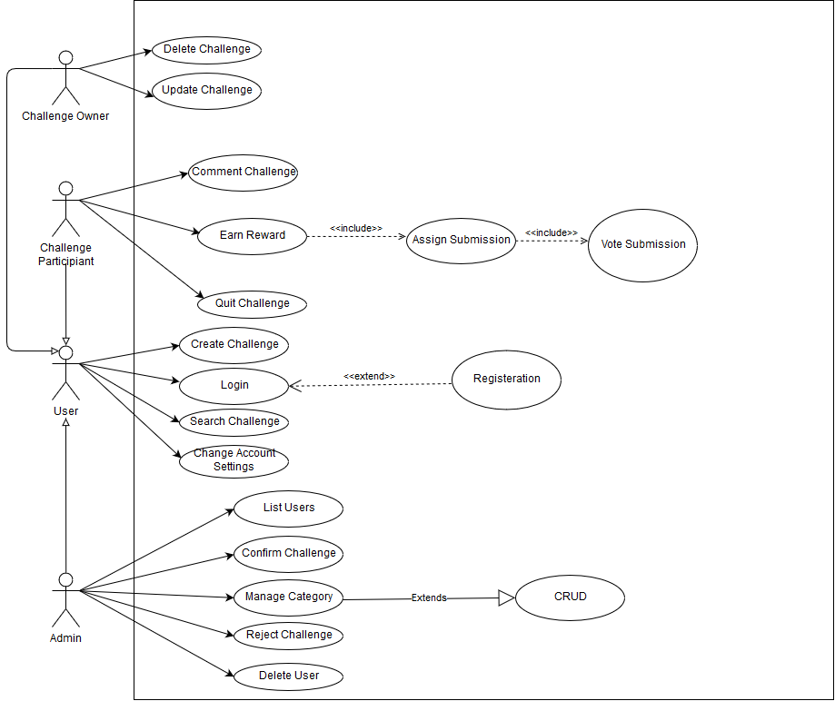

### installation

- run the docker
  `npm run docker`
- create database as `bravado`
- create tables
  `npm run setup`
- run!
  `npm run dev`

### todos

- [x] Login
- [x] Register
- [x] Change Account Settings
- [ ] Challenge [CRUD]
  - [x] Create Challenge
  - [ ] Confirm Challenge
  - [ ] Reject Challenge
  - [ ] Delete Challenge
  - [ ] Update Challenge
- [ ] Quit Challenge
- [ ] Manage Category [CRUD]
- [ ] Delete User
- [ ] Comment Challenge
- [ ] Earn Reward
- [ ] Comment Challenge
- [ ] Assign submission
- [ ] Vote submission

### Use case diagram

